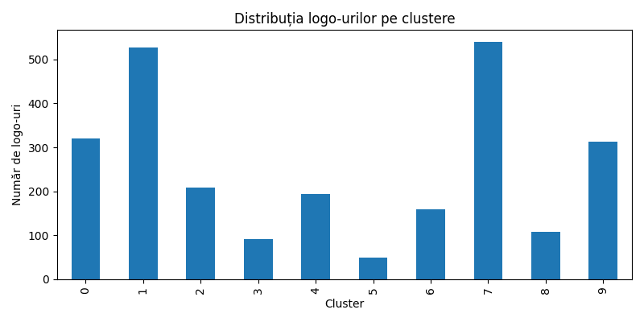

# Logo Similarity Clustering

Group websites by how their logos *look*, not by what their text says.

This project takes a list of ~4,400 domains, collects each site's logo (favicon first, HTML scraping as a fallback), turns every image into a visual embedding with **MobileNetV2**, and clusters those embeddings with **KMeans** to find visually similar brands.

Built for the Veridion Logo Clustering Challenge.

---

## How It Works

```
Data/logos.snappy.parquet          4,384 domains
            │
            ▼
   download_logos.py               favicon.ico → fallback: scrape <link rel="icon">
            │                      20 parallel workers, HTTPS with SSL-retry
            ▼
   logos_final/                    one PNG per domain
            │
            ▼
generate_embeddings.py             MobileNetV2 (ImageNet, global avg pooling)
            │                      224×224 → 1280-dim feature vector
            ▼
   logo_embeddings.csv             embeddings + domain column
            │
            ▼
    clustering.py                  KMeans, k = 10, random_state = 42
            │
            ▼
Output/clustered_logos.csv         2,511 logos assigned to 10 clusters
Output/cluster_distribution.png    bar chart of cluster sizes
```

---

## Project Structure

```
Logo-Similarity-Clustering-Challenge/
├── Data/
│   └── logos.snappy.parquet        Input: 4,384 website domains
├── Scripts/
│   ├── download_logos.py           Downloads favicons, scrapes logos as fallback
│   ├── generate_embeddings.py      Builds MobileNetV2 embeddings for every image
│   └── clustering.py               Runs KMeans and plots the distribution
├── Output/
│   ├── clustered_logos.csv         Result: domain → cluster
│   └── cluster_distribution.png    Bar chart of logos per cluster
├── requirements.txt
├── .gitignore
├── LICENSE
└── README.md
```

---

## Setup

```bash
git clone https://github.com/herralberrt/Logo-Similarity-Clustering-Challenge.git
cd Logo-Similarity-Clustering-Challenge

python3 -m venv .venv
source .venv/bin/activate        # Windows: .venv\Scripts\activate

pip install -r requirements.txt
```

Requires **Python 3.8+**. TensorFlow downloads the pre-trained MobileNetV2 weights (~14 MB) on the first run.

---

## Usage

Run the scripts from anywhere — each one resolves its paths relative to the repository, so no copying files around:

```bash
# 1. Collect the logos  (network-bound, the slowest step)
python3 Scripts/download_logos.py

# 2. Generate embeddings  (optional arg: image folder, default "logos_final")
python3 Scripts/generate_embeddings.py

# 3. Cluster and plot  (optional arg: number of clusters, default 10)
python3 Scripts/clustering.py 10
```

Step 1 writes `favicons/`, `scraped_logos/` and the merged `logos_final/`; step 2 writes `logo_embeddings.csv`; step 3 refreshes `Output/clustered_logos.csv` and `Output/cluster_distribution.png`. Everything except `Output/` is gitignored.

---

## The Scripts

### `download_logos.py`
Reads the domain list from `Data/logos.snappy.parquet` and tries, in order:

1. `https://<domain>/favicon.ico`
2. the homepage HTML, looking for `<link rel="...icon...">` and downloading that asset

Each HTTP request is retried once with SSL verification disabled before giving up. Successful images land in `favicons/` or `scraped_logos/`, then everything is copied into `logos_final/`. Uses a `ThreadPoolExecutor` with 20 workers and a browser `User-Agent`; DNS failures, timeouts and non-image responses are logged and skipped. Counting happens in the main thread as results arrive, so the totals are accurate under concurrency.

### `generate_embeddings.py`
Loads `MobileNetV2(weights='imagenet', include_top=False, pooling='avg')`, resizes each image to 224×224 and runs it through the network in batches of 32, producing a 1,280-dimensional vector per logo. Images that fail to decode are reported and skipped without disturbing the domain↔embedding alignment. Writes `logo_embeddings.csv`, with the domain kept in its own column.

### `clustering.py`
Drops the `domain` column, fits `KMeans(n_clusters=10, random_state=42, n_init=10)` on the embedding matrix, writes `Output/clustered_logos.csv` and renders the cluster-size bar chart. Accepts `k` as an optional command-line argument and uses the non-interactive Agg backend, so it runs headless.

---

## Results

| Metric | Value |
| --- | --- |
| Domains in the input set | 4,384 |
| Logos successfully collected and clustered | 2,511 (≈57%) |
| Embedding dimensions | 1,280 |
| Clusters | 10 |

**Logos per cluster**

| Cluster | 0 | 1 | 2 | 3 | 4 | 5 | 6 | 7 | 8 | 9 |
| --- | --- | --- | --- | --- | --- | --- | --- | --- | --- | --- |
| Logos | 321 | 527 | 208 | 92 | 194 | 49 | 160 | 540 | 107 | 313 |



The remaining ~43% of domains had no reachable favicon and no detectable icon link — dead domains, DNS failures, or sites serving their logo only through CSS or JavaScript.

---

## Notes & Known Limitations

- **`k` defaults to 10.** It is a manual choice, not a tuned one — pass a different value (`python3 Scripts/clustering.py 15`) or pick it with an elbow / silhouette analysis.
- **MobileNetV2 is trained on photographs**, not on flat vector marks. It separates logos well by dominant colour and gross shape, but is weaker at distinguishing two wordmarks that differ only by typeface.
- Logos are only ever fetched over `https://`; sites that serve exclusively over HTTP are missed.
- Roughly 43% of domains yield nothing — dead domains, DNS failures, or sites serving their logo only through CSS or JavaScript.
- `logos_final/`, `favicons/`, `scraped_logos/` and `logo_embeddings.csv` are gitignored — they are regenerated by the pipeline.

---

## Requirements

`pandas` · `requests` · `urllib3` · `beautifulsoup4` · `pillow` · `numpy` · `tensorflow` · `scikit-learn` · `matplotlib`

---

## License

MIT — see [LICENSE](LICENSE).
